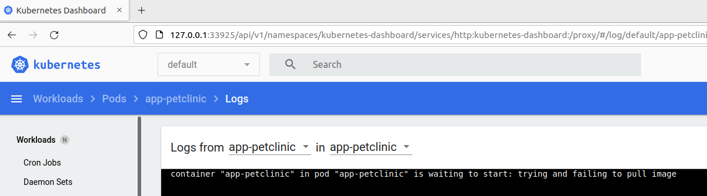
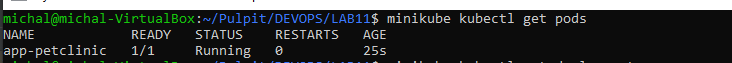

#  Michał Pieczonka - 303995
## Sprawozdanie 11

### Instalacja klastra Kubernetes
  * **Zaopatrz się w implementację stosu k8s: minikube**
   W celu instalacji minikube w pierwszym kroku przechodzę na [stronę zawierajacą link do tutoriala](https://minikube.sigs.k8s.io/docs/start/) <br>
  * **Przeprowadź instalację, wykaż poziom bezpieczeństwa instalacji** <br>
    W pierwszym etapie instalacji, zgodnie z instrukcją pobieram najnowszą wersję minikube ``curl -LO https://storage.googleapis.com/minikube/releases/latest/minikube_latest_amd64.deb`` <br>
    <br>  <br>
    Następnie poprzez ``sudo dpkg -i minikube_latest_amd64.deb`` uruchamiam instalację.
    <br> <br>
  * **Zaopatrz się w polecenie kubectl** <br>
    W celu 'zaopatrzenia się' w polecenie kubectl w pierwszym kroku - zgodnie z instrukcją instalacji - uruchamiam klaster poleceniem ``minikube start``. <br>
    W tym miejscu napotykam na pierwszy problem, konkretniej VM, z której korzystam posiadała przydzielony tylko 1 wątek procesora:
    <br> <br>
    W celu wyeliminowania powyższego programu modyfikuje ustawienia VM:
    <br> <br>
   Po ponownym uruchomieniu polecenia ``minikube start`` problem znika:
    <br> <br>
   Następnie w celu finalnego 'zaopatrzenia się' w polecenie kubectl uruchamiam komende ``minikube kubectl -- get po -A``.
    <br> <br>
  * **Uruchom Kubernetes, pokaż działający kontener/worker** <br>
   Poprzez ``docker ps`` pokazuje działający kontener.
    <br> <br>
  * **Zmityguj problemy wynikające z wymagań sprzętowych lub odnieś się do nich (względem dokumentacji)** <br>
    W  trakcie procesu instalacji napotkałem tylko 1 ograniczenie sprzętowe - przydzielony 1 wątek CPU dla VM - problem został rozwiązany powyżej, w związku z czym: <br>
     1) 2 CPUs or more ✅
     2) 2GB of free memory ✅
     3) 20GB of free dick space ✅
     4) Internet connection ✅
     5) Container or virtual machine manager: ✅ Docker 
  * **Uruchom Dashboard, otwórz w przeglądarce, przedstaw łączność** <br>
    Dashboard uruchamiam poprzez ``minikube dashboard``
    <br> <br>
    Przechodząc do przeglądarki (na hoscie (VM)) pod wskazany adres uzyskuję dostęp do Dashboardu:
    <br> <br>
  * **Zapoznaj się z koncepcjami funkcji wyprowadzanych przez kubernetesa (pod, deployment itp)** <br>
    ✅ <br>
###Analiza posiadanego kontenera
  * **Zdefiniuj krok "Deploy" swojego projektu jako "Deploy to cloud"**
    * **Deploy zbudowanej aplikacji powinien się odbywać "na kontener** <br>
      Utworzony w ramach projektu Jenkins-pipeline krok deploy odbywał  się jako uruchomienie aplikacji (Java - SpringBoot (Zwykły RESTOWY CRUD)) w 
      dedykowanym kontenerze. Poniżej w celu przypomnienia i potwierdzenia zamieściłem DockerFile kroku deploy wraz z stagem pipelinea:
     1) Dockerfile:  
         ```bash
        FROM openjdk:17-jdk-alpine       
        RUN apk add --no-cache --upgrade bash
        COPY build_result/final_app.jar /final_app.jar
        EXPOSE 8080
        ENTRYPOINT [ "java", "-jar", "final_app.jar" ]
        ````
     2) Stage Pipeline'a:
        <br>
    * **Przygotuj obraz Docker ze swoją aplikacją** <br>
      W związku z przedstawionym powyżej sposobem przygotowania kroku deploy w pipeline, przygotowanie obrazu w moim przypadku ograniczyło się "tylko" do wykorzystania obrazu zbudowanego w pipeline.
      Pojawił sie jednak problem - nieprzyjemne  "zapętlenie" tzn. Na hoscie (VM) stoi docker i minikube. Na dockerze stoi Jenkins, a w Jenkinsie jest Docker, który "ma"/"wie" o  obrazie, który chciałbym wykorzystać.
      Niestety  Docker z "zewnątrz" tzn. z hosta "nie wie" o istnieniu takiego obrazu, dlatego próba jego wykorzystania przez minikube (którym "steruje" docker z VM) zakończyłaby się niepowodzeniem. W związku z powyższym 
      wystąpiła potrzeba "minimalnego obejścia", w celu rozwiązania problemu. <br>
      Obejściem, które zastosowałem to "chwilowo" (docelowo w ramach pipeline, ale nie to było celem tego punktu sprawozdania) ręczne "wypchnięcie" obrazu z kontenera, w którym pracuje Jenkins do prywatnego repozytorium na dockerhub.
      Dzięki powyższemu rozwiązaniu, bez problemów, będe mógł potem wykorzystac przygotowany obraz z aplikacją. Tak więc poniżej w kilku krokach przedstawie sposób rozwiązania problemu:
    1) Zalogowanie do DockerHub:
    <br>
    2) Sprawdzenie i otagowanie obrazu:
    <br>
    3) Wypchnięcie obrazu do prywatnego repozytorium na DockerHub
    <br>
    4) Weryfikacja:
    <br>
    Po sukcesie wypchnięcia obrazu z aplikacją pozostało sprawdzic czy jest możliwe jego wykorzystanie do uruchomienie kontenera z aplikacją + sprawdzenie działania, tak więc ponownie kilka kroków, tym razem już bezpośrednio na hoscie z minikube:
    1) Ponowne zalogowanie do DockerHub'a - tym razem korzystajac z 'głownego Dockera' na hoście (VM)
    <br>
    2) Pobranie przygotowanego obrazu:
    <br>
    3) Uruchomienie kontenera korzystając z pobranego obrazu
    <br>
    Jak widać na powyżej przedstawionym zrzucie ekranu, problem został rozwiązana - kontener z działającą wewnątrz aplikacją działa (aplikacja uruchamia się wraz ze startem kontenera - zgodnie z założeniem, a także wyprowadza port), na bazie obrazu zbudowanego w trakcie działania pipeline'a
  * **Jeżeli wybrana aplikacja nie nadaje się do pracy w kontenerze i nie wyprowadza interfejsu funkcjonalnego przez sieć, wymień projekt na potrzeby tego zadania** <br>
    Aplikacja działa w kontenerze, mogę powiedzieć, że zrealizowałem prawie "plan max" - wykorzystany obraz to obraz wygenerowany wskutek pracy pipeline'a.
  * **Wykaż, że wybrana aplikacja pracuje jako kontener** <br>
    Wykazane powyżej.

###Uruchamianie oprogramowania
  * **Uruchom kontener na stosie k8s** <br>
    W pierwszym etapie pojawił się problem - kolejne dziwne 'zagniezdzenie' występujące prawdopodobnie tylko na ubuntu - polecenie ```docker images ``` uruchomione bezposrednio na hoscie - 'widzi' wcześniej przygotowany obraz, jednak próba utworzenia poda z wykorzystaniem owego obrazu powoduje błąd z następującym wynikiem:
    <br><br>
    Przeszukując fora w poszukiwaniu rozwiązania, natrafiłem na [rozwiazanie problemu](https://github.com/kubernetes/minikube/blob/0c616a6b42b28a1aab8397f5a9061f8ebbd9f3d9/README.md#reusing-the-docker-daemon) - jak zwykle docker deamon sprawił problem.
    Po uruchomieniu polecenia ``eval $(minikube docker-env)`` i wylistowaniu dostępnych obrazu zobaczyłem brak dociągniętego wcześniej oczekiwanego obrazu:
    <br><br>
    Tak więc ponownie 'dociągam' obraz  i upewnieniam się że jest on widoczny 'z poziomu minikube',
    <br><br>
    Finalnie mając już uruchomiony minikube (``minikube start``), kontener uruchamiam na stosie k8s uruchamiam poprzez polecenie ``minikube kubectl run -- app-petclinic --image=michalpieczonka4/devops_repository:deploy_app_image --port=8080 --labels app=app-petclinic``, gdzie 1 argumentem jest nazwa wdrożenia,
    następnie wykorzystuje dockerowy obraz z aplikacją, przygotowany wcześniej,  (i opisany powyżej) , wyprowadzam port - w moim przypadku - klasyczne 8080, a także określam nazwę wdrożenia - ostatni argument.
    W ten sposób uruchamiając kontener w minikube został on automatycznie ubrany w pod. 
  * **Przedstaw, że pod działa (via Dashboard oraz kubectl)** <br>
    Sprawdzenia dokonuje w pierwszym kroku poprzez polecenie ``minikube kubectl get pods`` - uzyskany wynik: RUNNING
    <br> <br>
    Następnie poprzez dashboard - również: RUNNING
    <br> <br>
    Dodatkowo zaglądając głebiej - w logi - widać, ze docelowa aplikacja została poprawnie uruchomiona i wystartowała na porcie 8080:
    <br> <br>
  * **Wyprowadź port celem dotarcia do eksponowanej funkcjonalności** <br>
    W celu wyprowadzenia portu uruchamiam polecenie ``kubectl port-forward app-petclinic 8080:8080`` - przekierowując port 8080 , na 8080, dzięki czemu dostęp do aplikacji w podzie będzie na porcie 8080. 
  * **Wyprowadź port celem dotarcia do eksponowanej funkcjonalności** <br>
    Z uwagi na to, iż uruchomiona aplikacja jest aplikacją napisaną w Javie + Spring-Boot - jest to restowa aplikacja - zerkając "głebiej" - w kod samej aplikacji - można zauważyc, że autorzy domyślnie pozostawili fajny feature udostępniany domyślnie,
    w każdej aplikacji Spring-bootowej - tzw. "Actuator" - pozwalający sprawdzić, status aplikacji, poprzez udostępnienie endpointu ``/actuator/health`` - pozwalający  wykonać tzw. 'health check' aplikacji (sprawdzić czy działa). <br>
    W związku z powyższym, korzystając z udogodnień wyboru hosta (VM z ubuntu) doinstalowując postmana i wykonuje http get request na endpoint: ``localhost:8080/actuator/health``, uzyskując następująca odpowiedz:
    <br>  <br>
    Jak widać - status: UP, natomaist status odpowiedzi żadania http: 200 (OK) - co świadczy o poprawnym działaniu aplikacji.
    Dodatkowo w sposób "prostszy", ale mniej czytelny można wykorzystac polecenie ``curl localhost:8080/actuator/health`` - efekt taki sam:
    <br>  <br>
    Ostatecznie - na potwierdzenie iż rzeczywiście requesty te trafiały bezpośrednio do aplikacji działającej w wcześniej uruchomionym podzie uruchamiam główny dashboard aplikacji w przeglądarce (na hoscie):
    <br>  <br>
###Przekucie wdrożenia manualnego w plik wdrożenia (wprowadzenie)
  * **Zapisanie wdrożenia jako plik YML** <br>
  Wdrożenie jako plik yml zapisuje, bazujac na przykładzie [zawartym w dokumentacji](https://kubernetes.io/docs/tasks/run-application/run-stateless-application-deployment/). Plik YML wdrożenia, który udało mi sie utworzyć przedstawiłem poniżej:
   ```bash
apiVersion: apps/v1
kind: Deployment
metadata:
  name: app-petclinic-deployment
  labels:
    app: app-petclinic
spec:
  replicas: 2
  selector:
    matchLabels:
      app: app-petclinic
  template:
    metadata:
      labels:
        app: app-petclinic
    spec:
      containers:
        - name: app-petclinic
          image: michalpieczonka4/devops_repository:deploy_app_image
          ports:
            - containerPort: 8080
  ```
  * **Dodanie replik** <br>
    Dodanie replik widnieje już w powyżej przedstawionym pliku yml wdrożenia - w sekcji 'spec', jest to parametr ``replicas`` - przyjęta wartośc = 2.
  * **kubectl apply na pliku**<br>
    Finalnie - na końcu po utworzeniu pliku wdrożenia uruchamiam wdrożenie poleceniem ``minikube kubectl -- apply -f deployment-app-petclinic.yml``, z następującym rezultatem:
    <br>  <br>
    Po sprawdzeniu dashboardu - widać, że deployment zakończył się sukcesem - status running  (oraz 2 pody działające):
    <br> 