#  Michał Pieczonka - 303995
## Sprawozdanie - pipeline
Głównym celem realizowanym w poniższym sprawozdaniu jest wykonanie pełnej konfiguracji środowiska, które umożliwi utworzenie, a następnie w miare potrzeb odtworzenie Jenkinsowego pipeline’a składającego się z minimum 4 kroków – Build, Test, Publish, Deploy.  W związku z powyższym w moim sprawozdaniu każdy z etapów, który był konieczny do uzyskania efektu końcowego – działającego i wykonującego zadanie w wersji co najmniej minimalnej – pipeline’a – opisałem w kolejności ich wykonywania. Dodatkowo w miare możliwości, każdy krok pipeline’a został opisany, tak aby dokonywane wybory/napotykane problemy były możliwe  do uzasadnienia/rozwiązania.


## Krótki opis pipeline'a - cel

Tworzony przezemnie pipeline jest pipelinem deklaratywnym, ponieważ jest to minimum, które jednak do działania i wykonania wszystkich wymagalny kroków jest  wystarczające.  
Aplikacja, na której bazuje jest aplikacją ``Javy`` – z wykorzystaniem frameworka ``Spring`` (Spring boot), natomiast narzędziem do zarządzania jest ``Maven``.

Dodatkowo – co będzie istotne w późniejszych etapach – w szczególności wyboru bazowego obrazu  do budowania – w repozytorium projektu(kodu) tym Maven jest już zawarty(jest to częsta praktyka – sądząc po repozytoriach „dużych” projektów, znajdujących się na githubie) . 
Kwestia ta jest dość istotna, ponieważ na tym etapie mógłbym znacznie uprościć cały pipeline i oprzeć całość o obraz ``openjdk-alpine``, który posiada tylko jdk niezbędne do późniejszego uruchomienia aplikacji w stepie deploy. Jednak to tylko komplikuje późniejsze kroki.
Utworzony pipeline sklada się z 7 kroków.  Jego finalnym efektem jest utworzony finalny arefakt będący ``„big jarem”`` – duży plik ``*.jar`` który został zbudowany w drugim stepie pipelinea – ``Build`` .  Utworzony artefakt – jar’ka – zawiera już wszystkie niezbędne dependencje, została przetestowana i uruchomiona na minimalnym środowisku, niezbędnym do działania. Dodatkowo nie potrzebuje instalatora, a jedynym wymaganiem do jej użycia jest jej uruchomienie -  w związku z powyższym efektem działania całego pipelinu będzie właśnie owa jar’ka.
W przypadku powodzenia wszystkich kroków spodziewany efekt jest następujący:

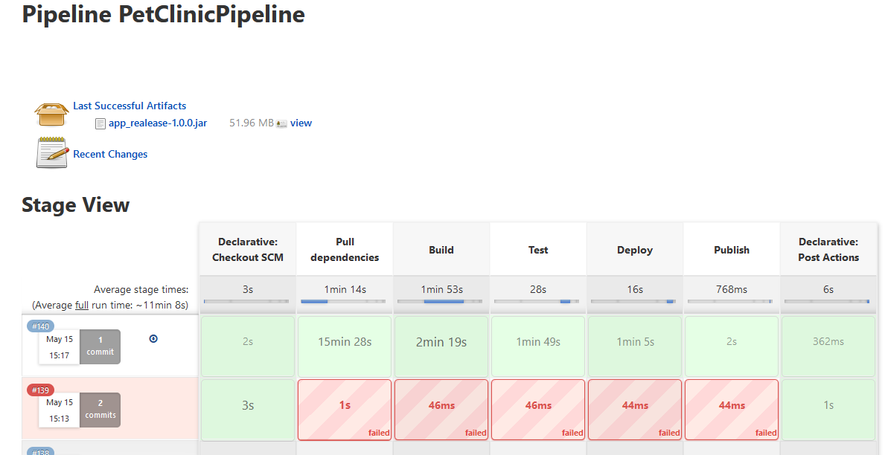

##1. Przygotowanie środowiska Jenkins
Pierwszym krokiem do stworzenia pipeline’a było zapewnienie środowiska – konkretniej kontener z Jenkins i DIND, skonfigurowany według instrukcji dostawcy oprogramowania.
Z uwagi na fakt iż instalacja i przygotowania samego środowiska, była przeze mnie odtwarzana w ramach realizacji jednego z tematów zawartych w laboratorium nr 4, gdzie w sprawozdaniu umieściłem szczegółowo w kilku krokach instalację i konfigurację środowiska – dlatego dokładny opis w poniższym sprawozdaniu pomine, natomiast pliki ``Dockerfile``, wdrażające Jenkinsa umieszczam w katalogu ``jenkins-setup``

##2. Definicja, opis i przygotowanie pipeline
Po poprawnym przygotowaniu środowiska, przystąpiłem do tworzenia repozytorium, na którym w późniejszych etapach umieszczałem wszystkie niezbędne pliki/katalogi związane z pipelinem. Sprawozdanie zostało podzielone na kilka punktów, w których zawarty jest opis każdego kroku pipeline’a i związanego z nim dockerfila,
wraz z ``argumentacją i opisem`` podjętych działań (jeżeli takowe były i były istotne).

###2.1 Przygotowanie repozytorium
Po poprawnym przygotowaniu środowiska przystąpiłem do przygotowania repozytorium, na którym w późniejszych etapach będę umieszczał poszczególne pliki niezbędne do przeprowadzenia wszystkich stepów zawartych w pipelini’e oraz sam Jenkinsfile, który go definuje.  
W pierwszmy kroku, sforkowałem repozytorium projektu ,na którym bazuje pipeline – [Spring PetClinic](https://github.com/spring-projects/spring-petclinic) . Następnie, utworzyłem nowy pipeline:

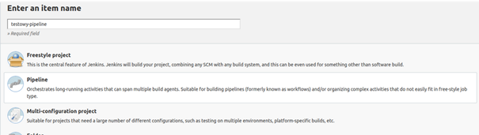

Kolejno w definicji pipeline’a zamiast standardowego ``Pipeline script`` – wybrałem ``Pipelinescript from SCM`` oraz ``SCM – GIT``,
natomiast w polu ``repository`` umieściłem adres repozytorium, z którego definicja Pipeline’a będzie pobierana – w moim przypadku  ``git@github.com:michalpieczonka/spring-petclinic.git``
Opcję te wykorzystalem dlatego aby zamiast dodatkowo wykonywać klona repozytorium, rozpakowywać i kontynuować zabawę postanowiłem  uprościć ten krok i wykorzystać możliwość, którą daje sam Jenkins.
Jako Credentiale wybrałem uwierzytelnianie przez klucz ssh – nie wdając się w szczegóły konfiguracyjne – wykorzystałem [tutorial](https://www.thegeekstuff.com/2016/10/jenkins-git-setup/) .

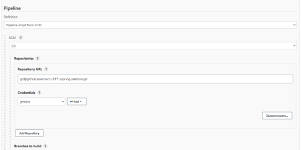

Tak przygotowane środowisko umożliwi operowanie tylko na samym Jenkinsfile i odpowiednich dla danego kroku pipeline’a dockerfile’ach. W kolejnym kroku przystąpiłem  już bezpośrednio do tworzenia właściwego Pipeline’a.

## 2.2 Definicja, opis pipeliena
Jak już wcześniej napisałem pipeline złożony jest z 7 kroków, które wraz z dockerfile’ami opisałem poniżej.
### 2.2.0 „Checkout SCM”

Krok domyślnie zdefiniowany przez Jenkins’a, ze względu na to iż w trakcie tworzenia projektu wybrałem ``Pipelinescript from SCM`` – rozwiązanie wybrałem przede wszystkim ze względu na wygodę i uproszczenie całości, dzięki czemu już na starcie pipeline’a repozytorium wraz z tagami i commitami jest już pobrane i widoczne w kontenerze Jenkinsa, co później okazało się przydatne.

### 2.2.1 – Pull dependencies
#### Cel:
Utworzenie obrazu, który zawiera wszystkie niezbędne dependencje projektu. <br>
W wyniku jego działania (Stage'a) wszystkie niezbędne dependencje projektu zdefiniowane w pliku ``pom.xml`` zostają pobrane, dzięki czemu w późniejszych krokach pipeline’a istnieje możliwość zachowania sporej ilości czasu, co zostało opisane w sprawozdaniu w kolejnych punktach.

#### Wykonanie, opis:
Dodanie omawianego kroku okazało się niezbędne, ponieważ występowały dwa problemy.<br> Pierwszym z nich była koncepcja wykorzystania maven’a który był zawarty już w wybranym repozytorium. Tutaj jednak pojawił się spory problem.<br> Z uwagi na to iż projekt jest aplikacją ‘spring-bootowa’ zawiera cała mase zależności – zależności te są sprawdzane i w razie potrzeby pobierane przez mavena przed wykonaniem builda. <br>W związku z powyższym po zidentyfikowaniu problemu – jedyną możliwością było zmodyfikowanie folderu ``/root/.m2`` w którym znajduje się katalog ``repository`` zawierający wszystkie zależności niezbędne dla projektu.<br>
Modyfikacja ta polegała na tym, aby wykorzystać volumin, który będzie tworzył lokalne repozytorium dla owych zależności. Tutaj pierwszym problemem było brak możliwości znalezienia takiego folderu przy wykorzystaniu zawartego w projekcie wrapera (mavena). Dlatego postanowiłem w krokach ``pull, build i test`` wykorzystać jako obraz bazowy  ``maven-openjdk17`` , ponieważ tutaj problem braku cachowania repozytorium udało mi się rozwiązać poprzez „imitacje” lokalnego repozytorium.
#####Stage pipeliena:
```groovy
stage("Pull dependencies") {
    steps {
        script {
            echo '.::Dependencies pulling started::.'
            docker.build("predependencies", ". -f Dockerdep")
            sh 'echo PreDependencies container has been built'
            sh 'docker run -v \$(pwd)/maven-dependencies:/root/.m2 -w /petclinic-app --name temp-container predependencies mvn dependency:resolve'
            sh 'docker commit temp-container dependencies'
            sh 'docker rm temp-container'
        }
    }
}
```
#####Wykorzystany dockerfile
```groovy
FROM maven:3.8.5-openjdk-17
COPY pom.xml /petclinic-app/pom.xml
```
Na tym etapie w pierwszym kroku buduje obraz na bazie ``maven:3.8.5-openjdk-17`` (maven z jdk, ponieważ będzie to konieczne w etapie testowania i testow integracyjnych, co zostało opisane poniżej). <br>
Następnie kopiowany jest plik ``pom.xml``, w którym zdefiniowane są wszystkie niezbędne zaleznosci. Kolejno wewnątrz pipeline’a – uruchamiany jest kontener tymczasowy, na bazie obrazu utworzonego powyższym dockerfilem,<br>
wraz z zamontowaniem volumenów – volume wejściowy ``maven-dependencies`` będzie imitował „lokalne repozytorium” natomiast miejscem montowania jest docelowy folder ``/root/.m2`` , który Maven w trakcie startu skanuje w celu zweryfikowania zależności (zdefiniowanych w pom.xml).<br>
Dodatkowo poprzez ``-w`` ustawiam miejsce, w którym uruchomiona zostanie komenda ``mvn dependency:resolve`` – która wykona docelowy krok – zweryfikowanie zależności i ich ewentualne pobranie (na zdefiniowany volume i lokalnie i w kontenerze). <br>
W ostatnim kroku poprzez ``docker commit`` tworze docelowy obraz ze wszystkimi zależnościami z pełną świadomością iż jest to sposób raczej „drutowany”, ale rozwiązuje problem i zdecydowanie jest to lepsza opcja niż każdorazowe pobranie zależności w kroku build. <br>
Dodatkowo dzięki zastosowaniu takiego podejścia i wykorzystaniu cache dockera, obraz ten będzie przebudowywal się tylko wtedy kiedy nastąpi jakakolwiek zmiana w pliku ``pom.xml`` , dodatkowo braku kopiowania kodu źródłowego aplikacji do powyższego kontenera pozwala uniknąć niechcianego przebudowywania i pobierania depdencji wtedy, kiedy nastąpi jakaś zmiana w kodzie.

### 2.2.2 – Stage 'Build'
#### Cel:
Zbudowanie aplikacji w formie ``big-jar``’a, i odłożenie go na wpięty volume. W przypadku powodzenia pozostałych stepow pipeline’a jar’ka ta zostanie oznaczona odpowiednim numerem wersji i będzie wynikowym artefaktem całego pipeline’a.

#### Wykonanie, opis:
W kroku tym, bazując na obrazie utworzonym w poprzednim stage’u uruchamiany jest docelowy build programu, wykorzystując `dockerfile`, w którym dodatkowo kopiowany jest kod źrodlowy programu i uruchamiana jest docelowa komenda odpowiedzialna za przeprowadzenie builda ``mvn clean package`` z  pominieciem testow ``-dskipTests``.<br>
Dzięki zastosowaniu poprzedniego ‘obejscia’ z dodatkowym krokiem, w trakcie którego budowany jest obraz zawierający już wszystkie dependencje czas builda skrócił się w sposób istotny.

#####Stage pipeliena:
```groovy
stage('Build') {
    steps {
        script {
            echo '.::Build started::.'
            sh 'ls'
            def imageBuild = docker.build("builder", ". -f Dockerbuild")
            sh 'rm -rf output_volume'
            sh 'mkdir output_volume'
            imageBuild.run("-v \$(pwd)/output_volume:/build_result")
            sh 'ls output_volume'
        }
    }
}
```
#####Wykorzystany dockerfile
```groovy
FROM dependencies
COPY src /petclinic-app/src
WORKDIR /petclinic-app
RUN mvn clean package -DskipTests
ENTRYPOINT [ "cp", "target/spring-petclinic-2.6.0-SNAPSHOT.jar", "/build_result/final_app.jar" ]
```
### 2.2.3 – Stage 'Test'
#### Cel:
Uruchomienie wszystkich testów znajdujących się w kodzie programu.

#### Wykonanie, opis:
W kroku tym, bazując na obrazie utworzonym w poprzednim stage’u , w którym aplikacja została już  zbudowana, uruchamiane są jedynie wszystkie testy znajdujące się w kodzie programu.<br> Co istotne wykorzystana komenda - ``mvn surfire:test`` pozwala na pominięcie etapu budowania (z uwagi na sposob dzialania maven'a - wszystkie etapy przed testem rownież domyślnie zostalyby wykonane - to nie jest potrzebne, poniewaz aplikacja została już zbudowana). <br>
Tutaj również - jak wspomniałem w pierwszym punkcie sprawozdania – zastosowałem jako obraz bazowy ``maven:3.8.5-openjdk-17`` – czyli poza mavenem jest również jdk, niezbędne do uruchomienia aplikacji.<br>
W tym wypadku program posiada również testy integracyjne – które w springboocie – do uruchomienia potrzebują również uruchomienia tzw. ``kontekstu Springa`` a więc defacto uruchomienia aplikacji, dlatego obraz typu ``maven:alpine`` okazał się niewystarczający – stąd wybór – maven z jdk.

#####Stage pipeliena:
```groovy
stage('Test') {
    steps {
        script {
            echo '.::Tests started::.'
            docker.build("tester", ". -f Dockertest")
        }
    }
}
```
#####Wykorzystany dockerfile
```groovy
FROM builder:latest
RUN mvn surefire:test
```

## 2.2.4 – Stage 'Deploy'
#### Cel:
Uruchomienie zbudowanej  (stage build) i przetestowanej (stage test) aplikacji w środowisku minimalnym.
#### Wykonanie, opis:
W kroku tym wykorzystanym obrazem jest już najmniejszy z możliwych (ale wystarczający) obraz ``openjdk:17-jdk-alpine``.<br>
W realizacji tego kroku miałem niemały problem, aby wybrać sposób jego wykonania. Z uwagi na fakt iż analizowanym projektem jest aplikacja spring-bootow’a (w zasadzie webpage) kwestia ta stala się mocno zawiła.<br>
Największym problemem, który napotkałem była weryfikacja czy wdrożenie przebiegło pomyślnie, czy coś po drodze poszło nie tak.<br>
Dodatkowo w przypadku uruchomienia analziowanej aplikacji, jedyne co robi, bez ingerencji ‘z zewnątrz’ to nasłuchiwanie requestow, które dopiero wywołują jej działanie możliwe do weryfikacji w sposob "bezposredni".<br>
W związku z powyższym uznałem, że odpowiednim rozwiązaniem będzie uruchomienie aplikacji i po krótkim czasie (w którym aplikacja się uruchamia) wysłanie żądania http i sprawdzenie odpowiedzi – jakiejkolwiek, ponieważ jeśli wszystko od strony „technicznej’ jest wporzadku, aplikacja działa i nadaje się do użytku.<br>
Problem ten rozwiązałem poprzez ujęcie wszystkich kroków w blok ``try-catch``, wewnątrz którego, umieściłem blok ``timeout`` z czasem 1 minuty. <br>
Następnie aplikacja jest uruchamiana i po kolejnym sleepie (20s – bo tyle mniej więcej maksymalnie potrzeba aby aplikacja została uruchomiona) wysyłane jest żądanie poprzez ``curl``.  <br>
Powyższe podejście powoduje, że jeżeli w czasie całego bloku timeout, trwającego 1 minute, w trakcie którego nastąpi uruchomienie aplikacji i próba nawiązania z nią komunikacji, nie nastąpi żaden błąd, to zostanie wysłany sygnał ``interrupt``, dzięki czemu pipeline się nie zawiesi,<br>
a dodatkowo będzie możliwość wykrycia powodu wyjątku i odpowiednia jego obsługa, co zostało wykonane  poprzez złapanie wyjątku w bloku ``catch`` i porównanie go prostą instrukcją ``if`` z błędem wzorcowym, który jest wyzwalane poprzez ``interrupt`` (z timeout). <br>
Na tej podstawie jeżeli błąd jest inny niż oczekiwany działanie pipeline’a kończy się z błędem, ponieważ w trakcie uruchomienia aplikacji coś „poszło nie tak”, natomiast jeżeli jest to oczekiwany ``FlowInterruptedException`` – działanie można kontynuować, a wdrożenie można uznać za całkowicie poprawne.

#####Stage pipeliena:
```groovy
stage('Deploy') {
    steps {
        script {
            timeout (1) {
                try {
                    echo '.::Publishing::.'
                    echo 'Building deploy image'
                    sh 'docker build . --no-cache -f Dockerpublish -t deploy'
                    echo 'Starting application in pure dev container'
                    sh 'docker run --name deploy-container -d deploy'
                    sh 'sleep 20'
                    final String url = "http://localhost:8080"
                    final String response = sh(script: "curl -s $url", returnStdout: true).trim()
                    echo response
                    sh 'sleep 150'
                } catch (Exception e) {
                    echo 'Exception during timeout has been thrown with message'
                    echo e.toString()
                    if (e.toString() == "org.jenkinsci.plugins.workflow.steps.FlowInterruptedException") {
                        echo '.::Deployed successfully!::.'
                    } else {
                        throw new Exception(e.toString())
                    }
                    sh 'docker stop deploy-container'
                    sh 'docker rm deploy-container'
                }
            }
        }
    }
}	
```
#####Wykorzystany dockerfile
```groovy
FROM openjdk:17-jdk-alpine
RUN apk add --no-cache --upgrade bash
COPY output_volume/final_app.jar /final_app.jar
ENTRYPOINT [ "java", "-jar", "final_app.jar"]
```

## 2.2.5 – Stage 'Publish'
#### Cel:
Z uwagi na fakt iż w poprzednich krokach, zgodnie z założeniem utworzony został ``big jar`` ze wszystkimi dependencjami, jedynym celem tego kroku jest w przypadku zaznaczenia parametru ``PROMOTE`` i podania numeru wersji ``VERSION`` – zmiana nazwy arefaktu (big jar’a stworzonego w buildzie i odłożonego na volumienie, który przeszedł test i deploy) i dodatkowe  umieszczenie go jako  ``Build artifact``, co umożliwi jego pobranie z poziomu dashboardu Jenkinsa.
#### Wykonanie, opis:
####2.2.5 1) Przygotowanie parametrów
Dodanie parametru ``PROMOTE`` (wartość logiczna), którego zaznaczenie spowoduje iż w przypadku powodzenia wszystkich poprzednich kroków w pipeline'a  krok publish także zostanie wykonany. <br>
(Pobranie nowej wersji gotowej do wydania, odpowiednio otagowanej itd.). W przeciwnym wypadku, krok publish pipelina zostaje pomijany.<br>
W celu utworzenia powyższego parametru w pierwszym kroku w GUI Jenkinsa wyklikałem odpowiednie parametry ``General -> „To zadanie jest sparametryzowane” -> Wartość logiczna -> Nazwa = PROMOTE -> OPIS = „…”``

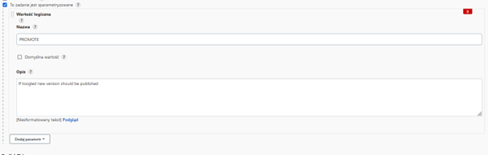

Następnie zmodyfikowałem pipeline, tak aby przyjmowal powyższy parametr i go odpowiednio uwzględnial w trakcie wykonania. W tym celu dodałem nową sekcje ``parameters`` 
```groovy
parameters {
    booleanParam(name: 'PROMOTE',  description: 'If toogled new version should be published')
    text(name: 'VERSION', defaultValue: '', description: 'Version number that will be published')
} 
``` 
Oraz w stage'u ``Publish``, dodatkowy warunek ``when`` , który realizuje swoje zadanie, co zostalo zaprezentowane poniżej, na listingu całego stage'a.<br>
Analogicznie postąpiłem w przypadku dodania drugiego parametru – ``VERSION`` który w przypadku gdy ``PROMOTE`` jest zaznaczone w kroku publish pobiera utworzony i przetestowany w poprzednich krokach plik ``JAR`` i nadaje mu odpowiednio nazwę: ``app_realease-<wartość_parametru_version>``. <br>

#####Stage pipeliena:
```groovy
stage('Publish') {
            when {
                expression { params.PROMOTE == true }
             }
              steps {
		echo '.::Publishing::.'	                           
                sh """mv output_volume/final_app.jar output_volume/'app_realease-${params.VERSION}.jar'"""
                archiveArtifacts artifacts: """output_volume/app_realease-${params.VERSION}.jar""", fingerprint: true			
            }
        }
```

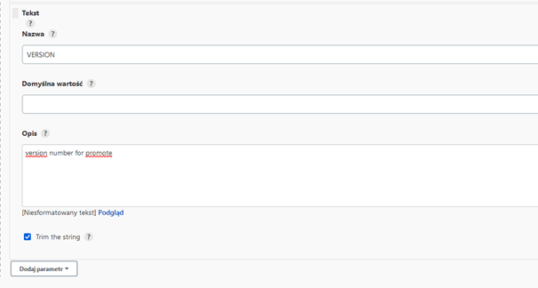

## 2.2.6 – Stage 'Post'
W ostatnim kroku pipeline’a każdorazowo czyszczony jest workspace a użytkownik informowany jest o wyniku pipeline’a.<br>
W przypadku powodzenia, postanowiłem pozostać tylko przy wiadomości o jego pozytywnym przejściu wszystkich kroków (zakładam, że tak będzie znacznie częściej), natomiast w przypadku błędu (którego się nie spodziewam :D) postanowiłem „doposażyć” pipeline o wysylanie notyfikacji emailem.<br>
Dokonuje tego poprzez ustawienie pluginu Email extenstion ``(Manage Jenkins -> Email Extension)`` w głownych ustawieniach Jenkinsa: <br>

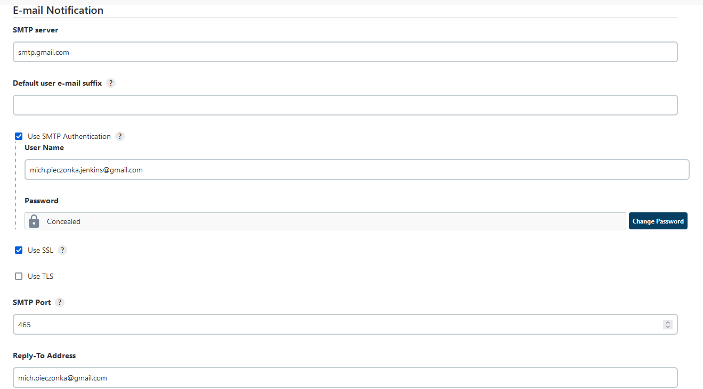

Natomiast w definicji pipeline’a wywołuje funkcje ``emailtext`` wraz z odpowiednimi  parametrami. Do wysylania emaili używam SMTP Gmaila, ponieważ uważam, ze na aktualnym etapie „rozbudowania” pipeline’a jest to zdecydowanie wystarczające.
#####Stage pipeliena:
```groovy
post {
	 always {
            cleanWs()
        }
        success {
            echo '.::Succeeded, Saving artifact::.'
        }
        failure{
                echo '.::Pipeline FAILED::.'
                mail bcc: '', body: "<b>Pipeline FAILED</b><br>\n<br>Project: ${env.JOB_NAME} <br>Build Number: ${env.BUILD_NUMBER} <br> Jenkins URL: ${env.BUILD_URL}", cc: '', charset: 'UTF-8', from: '', mimeType: 'text/html', replyTo: '',subject: "ERROR CI: in project -> ${env.JOB_NAME}", to: "mich.pieczonka@gmail.com";
        }
    }
```
Przykładowe wyniki działania, w przypadku braku pozytywnego przejścia pipeline'a przedstawiłem poniżej:
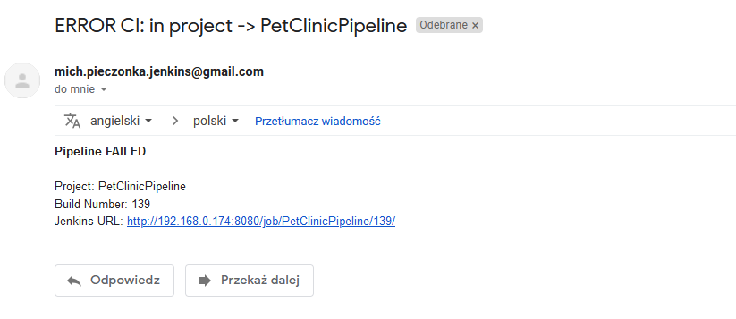

##3. Jenkinsfile
Wszystkie powyżej przedstawione poszczególne stage ujęte są w jeden ``Jenkinsfile``, ktory znajduje sie w katalogu ``jenkinsfile`` w moim repozytorium. Dodatkowo całościowy listing zamiesciłem poniżej:
```groovy
pipeline {
    agent any
	parameters {
	booleanParam(name: 'PROMOTE',  description: 'If toogled new version should be published')
	
	text(name: 'VERSION', defaultValue: '', description: 'Version number that will be published')
	}        
    stages {
        stage("Pull dependencies") {
            steps {
                script {
                    echo '.::Dependencies pulling started::.'
                    docker.build("predependencies", ". -f Dockerdep")
                    sh 'echo PreDependencies container has been built'
                    sh 'docker run -v \$(pwd)/maven-dependencies:/root/.m2 -w /petclinic-app --name temp-container predependencies mvn dependency:resolve'
                    sh 'docker commit temp-container dependencies'
                    sh 'docker rm temp-container'
                }
            }
        }
        
        stage('Build') {
            steps {
                script {
                    echo '.::Build started::.'
                    sh 'ls'
                    def imageBuild = docker.build("builder", ". -f Dockerbuild")
                    sh 'rm -rf output_volume'
                    sh 'mkdir output_volume'
                    imageBuild.run("-v \$(pwd)/output_volume:/build_result")
                    sh 'ls output_volume'
                }
            }
        }
        stage('Test') {
            steps {
                script {
                    echo '.::Tests started::.'
                    docker.build("tester", ". -f Dockertest")
                }
            }
        }
        stage('Deploy') {
            steps {
                script {                              
			timeout (1) {
				try {
                                     echo '.::Publishing::.'
				     echo 'Building deploy image'
				     sh 'docker build . --no-cache -f Dockerpublish -t deploy'
				     echo 'Starting application in pure dev container'
				     sh 'docker run --name deploy-container -d deploy'
				     sh 'sleep 20'
				     final String url = "http://localhost:8080"
                                     final String response = sh(script: "curl -s $url", returnStdout: true).trim()
                                     echo response							
				     sh 'sleep 150'
				} catch (Exception e) {
				     echo 'Exception during timeout has been thrown with message'
                                     echo e.toString()
					if (e.toString() == "org.jenkinsci.plugins.workflow.steps.FlowInterruptedException") {
						echo '.::Deployed successfully!::.'
					} else {
						throw new Exception(e.toString())
					} 
                               sh 'docker stop deploy-container'
                               sh 'docker rm deploy-container'                                                   
						}
					}
				}
			}
		}		
	stage('Publish') {
            when {
                expression { params.PROMOTE == true }
             }
              steps {
		echo '.::Publishing::.'	                           
                sh """mv output_volume/final_app.jar output_volume/'app_realease-${params.VERSION}.jar'"""
                archiveArtifacts artifacts: """output_volume/app_realease-${params.VERSION}.jar""", fingerprint: true			
            }
        }
    }
    post {
	 always {
            cleanWs()
        }
        success {
            echo '.::Succeeded, Saving artifact::.'
        }
        failure{
                echo '.::Pipeline FAILED::.'
                mail bcc: '', body: "<b>Pipeline FAILED</b><br>\n<br>Project: ${env.JOB_NAME} <br>Build Number: ${env.BUILD_NUMBER} <br> Jenkins URL: ${env.BUILD_URL}", cc: '', charset: 'UTF-8', from: '', mimeType: 'text/html', replyTo: '',subject: "ERROR CI: in project -> ${env.JOB_NAME}", to: "mich.pieczonka@gmail.com";
        }
    }
}
```
## Diagramowanie UML

### Diagram aktywności

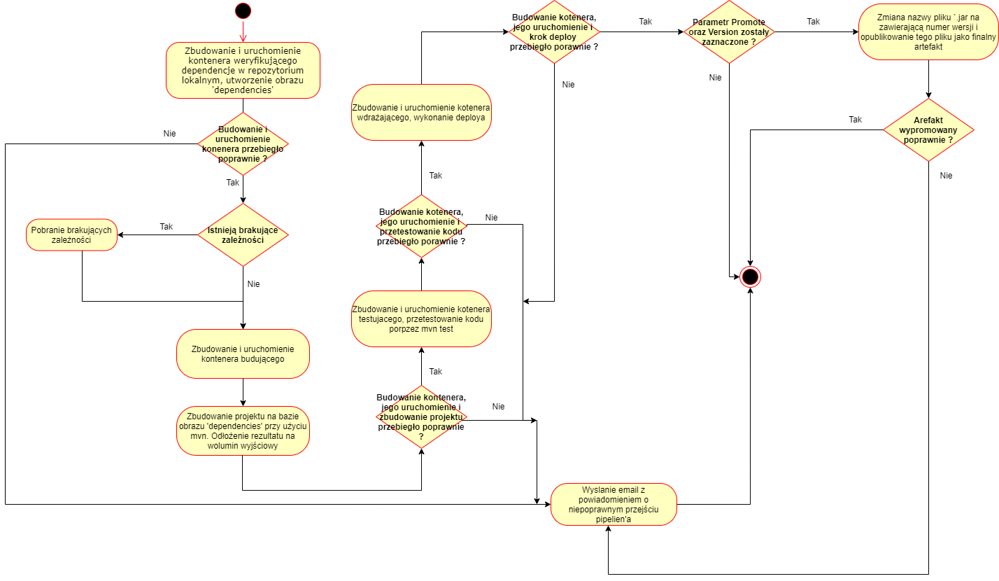

### Diagram wdrożenia

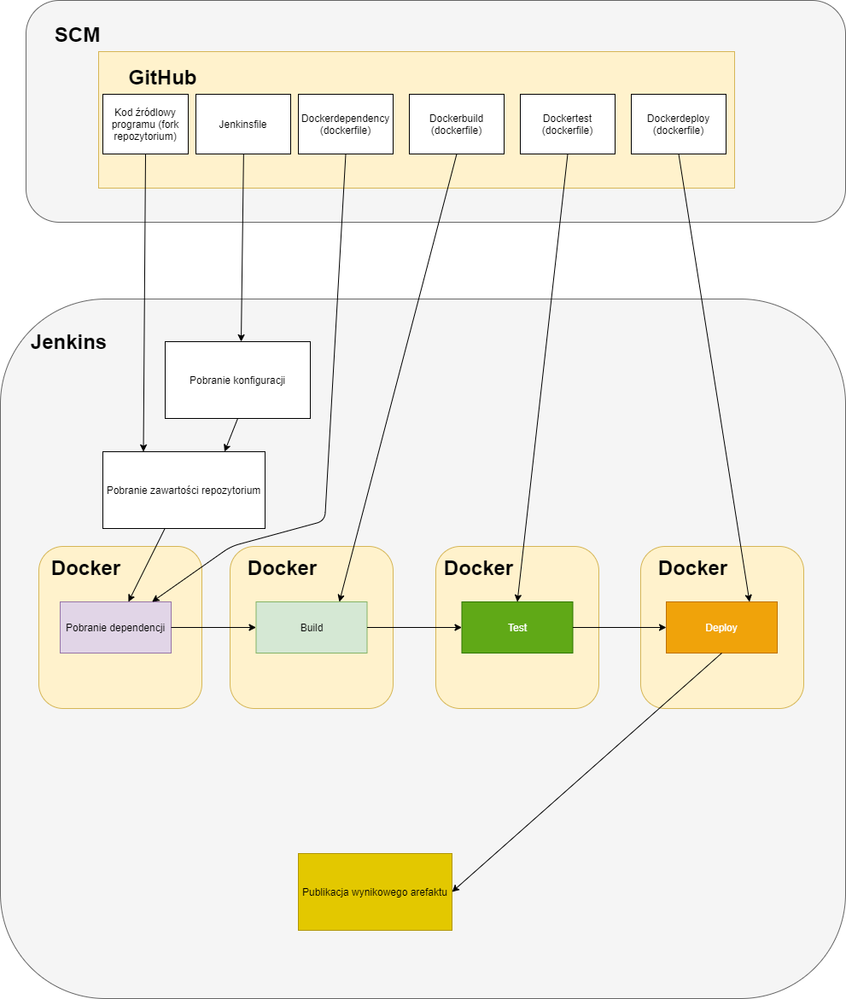

## Podsumowanie

W wyniku przeprowadzenia wszystkich powyższych kroków, jeżeli wszystko po drodze pójdzie bez błędów, powinniśmy uzyskac następujący wynik: <br>
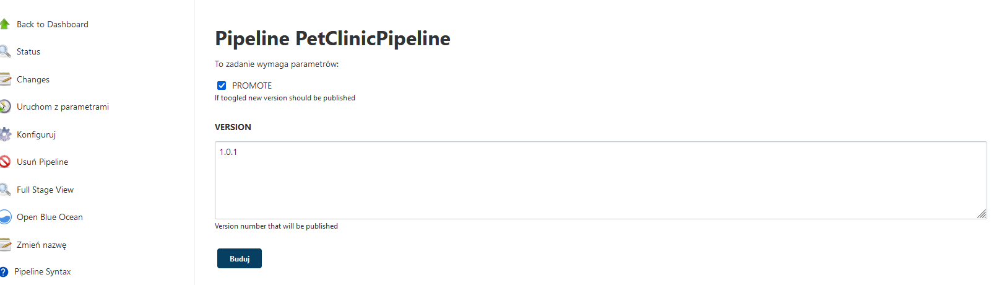

#### Wynik pozytywnego przejścia calego pipeline'a wraz z finalnym artefaktem, możliwym do pobrania z poziomu dashboardu Jenkinsa:


15 minutowy stage 'pull dependencies', ponieważ wcześniej dla testu wyczyściłem zawartość dołączanego volume, każdy następne przejście pipelina powodowało następujący rezultat: 

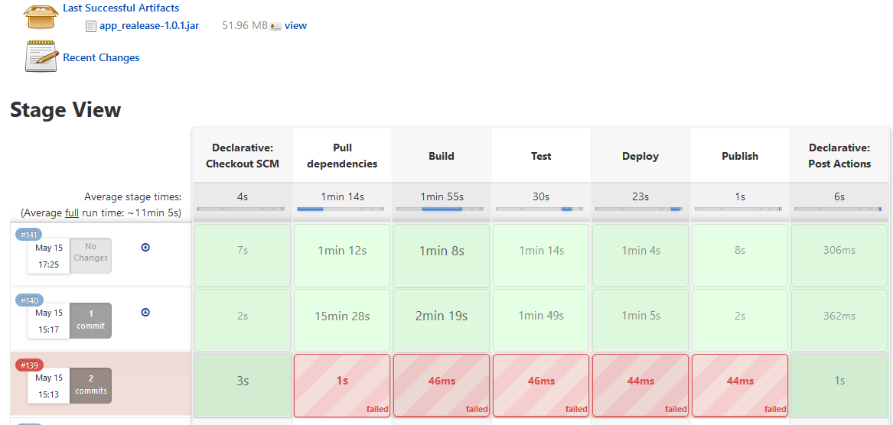
Finalnie mogę powiedzieć, że mój  projekt pipeline’a na pewno nie jest idealny, posiada sporo „obejść”, które musiałem zastosować, ale mimo wszystko spełnia swoją rolę w 100% - dostarcza w pełni zbudowany, przetestowany i sprawdzony artefakt wynikowy.<br>
Ponadto realizuje wszystkie kroki zawarte w wytycznych do sprawozdania. Co więcej najbardziej istotne kwestie, w szczególności problemy cachowania repozytoriów mavena, czy obrazów dockerowych zostały rozwiązane, dzięki czemu Pipeline nie tylko działa, ale także działa w miare sprawnie i dość szybko. <br>
Dodatkowo sam Jenkins zdecydowanie ułatwia pracę w ciągłej integracji i dostarczaniu oraz daje sporo możliwości, w szczególności w połączeniu z możliwościami wykorzystania skryptow pisanych w Groovym. 
